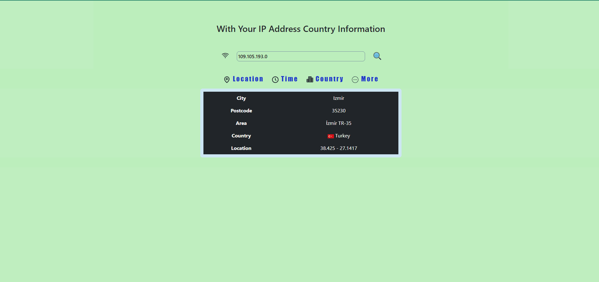

<h1>Soner Yılmaz</h1>
<h3>IPLocationApp</h3>

<br>

## Project Skeleton

```
IPLocationApp(folder)
|
|----readme.md         
SOLUTION
├── public
│     └── index.html
├── src
│    ├── components
│    │       ├── Header.jsx
│    │       ├── Searched.jsx   
│    │       ├── Navigation.jsx 
│    │
|    |──────── context  
│    │       ├── UserIPAdrdress.jsx   
│    │       ├── UserIPAdrdress.jsx 
|    | 
│    │ 
│    ├──────css
│    │        ├── app.css      
│    ├──────pages 
│    │         ├── Country.jsx
│    │         ├── Location.jsx
│    │         ├── More.jsx
│    │         ├── Time.jsx
│    │         ├── Home.jsx
│    │
│    ├──────router
│    │         ├── AppRouter.jsx
│    │
│    │
│    |
│    ├── App.js
│    ├── index.js
│    └── index.css
├── package.json
└── yarn.lock
```

## Objective

Build a IPLocationApp using ReactJS.

### At the end of the project, following topics are to be covered;

- HTML

- CSS

- JS

- ReactJS

## IPLocationApp Demo
[IPLocationApp](https://react-product-list-sigma.vercel.app/)


## IPLocationApp Projects




